# 1. Introduction
## 1.1 Overview of Task & Research Questions

Our project is a **single-label multi-class text classification for cyberbullying detection in tweets**. For a given tweet, the goal is to assign it exactly one category in the `cyberbullying_type` column. The labels for cyberbullying can be categorized by `age`, `gender`, `religion`, `ethnicity`, `other_cyberbullying` or `not_cyberbullying`. 

Unlike traditional hate speech detection, which is typically framed as a binary (yes/no) classification task, our project would involve classifying each tweet into one of several closely related categories. This makes the task more challenging, as the classes often overlap in meaning. Additionally, the tweets are short, informal, and lacks context, which increases ambiguity. This therefore makes it harder for models to be able to accurately distinguish between categories.

As part of our project, our team came up with the following research questions in order to guide the direction of our project.

1. How do classical machine learning models compare against a deep learning model (Bi-LSTM) for multi-class cyberbullying detection?
2. Which cyberbullying categories are the most difficult to classify accurately?
3. What linguistic patterns and dataset characteristics contribute to model errors?

---

## 1.2 Motivation

In today's world, social media platforms have become central to modern communication, but they have also contributed to the rise of cyberbullying and online harassment. Detecting harmful content in such settings is often difficult because abusive language is often expressed through subtle linguistic cues such as sarcasm, slang and implicit aggression. Even when the task is framed as assigning one primary label per tweet, the underlying language can still be ambiguous and be difficult to interpret.

In reality, a single twitter post may contain multiple different forms of abuse at once. However, the dataset used in this project constrains the task to a **single-label classification**. This means that each tweet is assigned only one annotated category. This therefore makes the task more tractable for modeling while also introducing important limitations in how well the dataset reflects real cyberbullying behavior.

---

## 1.3 Contributions

This project contributes to this space by providing:

- A comparative evaluation of multiple classical machine learning models (**Naive Bayes, Logistic Regression, Support Vector Machine, Random Forest**) and a deep learning model (**Bi-LSTM**)
- An evaluation using the standard **multi-class classification metrics** such as precision, recall, F1-score, and accuracy
- A structured error analysis to better understand model behavior beyond its overall scores
- Insights into the linguistic and data driven challenges of cyberbullying detection

### 1.3.1 Member Contributions
| S/N | Team Members | Part |
| :-: | :- | :- |
| 1 | Zhan You Lau | Data Preparation & Cleaning, Data Visualization, Error Partitioning, Conclusion, Consolidation |
| 2 | Yu Chen Law | Data Preparation & Cleaning, Machine Learning Models, Master Error Table, Cross Model Behaviour Analysis |
| 3 | Kieran E Kai Voo | Machine Learning Models, Weights saving, Misclassification Pattern Analyiss |
| 4 | Joshua, Tse Ern Foo | Data Visualization, Machine Learning Models, Qualitative Error Analysis |

---

# 2. Brief Literature Review

Cyberbullying and abusive language detection have received considerable attention in natural language processing across traditional machine learning, dataset development, and deep learning approaches.

Waseem and Hovy (2016) showed that traditional machine learning models can provide strong baseline performance for detecting abusive language on Twitter when combined with features like character n-grams. Their findings motivate our inclusion of Naive Bayes, Logistic Regression, SVM, and Random Forest, as well as TF-IDF vectorization. 

Building on this, Salawu et al. (2021) introduced large-scale datasets with fine-grained annotation schemes that support multi-class labelling across specific categories of harm. This is precisely the setting our project operates in, and motivated our decision to evaluate performance at the class level rather than relying on aggregate accuracy alone.

Pavlopoulos et al. (2017) and Park and Fung (2017) found that neural models can capture context more effectively than bag-of-words approaches in some settings. This supports our decision to include a Bi-LSTM as the deep learning model in our comparison. However, Wiegand et al. (2019) highlighted that label ambiguity and dataset bias impose a performance ceiling that architecture alone cannot overcome. This idea is important to our error analysis.

While prior work largely focuses on binary detection or benchmark improvement, there has been limited systematic comparison of how different model families confuse closely related categories in a multi-class cyberbullying setting. This is the gap our project addresses.
 
---

# 3. Methods

## 3.1 Dataset

The dataset used in this project is the [Cyberbullying Classification Dataset](https://www.kaggle.com/datasets/andrewmvd/cyberbullying-classification) from Kaggle. It consists of tweets that are labeled in the `cyberbullying_type` column. Each tweet is assigned exactly one class. The classes would include categories that different forms of cyberbullying associates with as well as a non-cyberbullying category.

---

## 3.2 Preprocessing

This is carried out so that we can standardize the tweets while retaining its linguistically meaningful content as much as possible. Since such tweets are often noisy and irregular, preprocessing is therefore neccessary in order to ensure that the data is usable for downstream models.

Therefore, in order to reduce noise and improve the quality of the text representations, the following preprocessing steps were applied:

- Conversion to lowercase  
- Removal of user mentions (`@username`)  
- Removal of URLs and picture links  
- Removal of punctuation and numbers 
- Removal of stray HTML entities  
- Removal of English stopwords  
- Removal of short words with length less than or equal to 2  
- Removal of extra whitespace 

---

## 3.3 Exploratory Analysis

Before training the models, exploratory data analysis was conducted to better understand the dataset and its label structure. This included examining the distribution of tweets across labels and visualizing vocabulary patterns using word clouds. These analyses help identify class imbalance, common language usage, and potential sources of ambiguity between labels.

  
  
<em><b>Figure 1. Class distribution of tweets across cyberbullying categories.</b></em>

The class distribution shows that the dataset is not perfectly balanced across categories, which may influence model performance and bias predictions towards more frequent classes.

To further analyze linguistic patterns, word clouds were generated for each label. A few selected word clouds for `gender`, `religion`, `ethnicity`, and `not_cyberbullying` labelled tweets are selected for illustration purposes.

  
  
<em><b>Figure 2a. Word cloud for gender category.</b></em>

  
  
<em><b>Figure 2b. Word cloud for religion category.</b></em>

  
  
<em><b>Figure 2c. Word cloud for ethnicity category.</b></em>

  
  
<em><b>Figure 2d. Word cloud for non-cyberbullying category.</b></em>

The word clouds above provides a high level view of the vocabulary used across the different labels. Certain labels, such as `religion` and `ethnicity`, exhibit more distinctive and topic specific terms that are related to identity and ideology. In contrast, categories such as `gender` and `not_cyberbullying` contains a more generic and conversational language.

Given this, it should be noted that there is a substantial overlap in frequently used words across labels, including general insults and informal expressions. This suggests that lexical features by itself may not be sufficient to clearly distinguish between the labels. Furthermore, many of the words are context dependent and they may appear in both harmful and non-harmful settings. This therefore further increases the ambiguity surrounding it.

Hence, these observations provides some insight as to why the models may struggle to separate closely related labels and are likely to produce confusion between certain labels during classification.

---

## 3.4 Feature Engineering

In this project, two main text representation strategies were used:

- **TF-IDF vectorization** for the classical machine learning models  
- **Word embeddings** for the Bi-LSTM model  

TF-IDF was chosen because it is a strong baseline for text classification. This is especially so when working with sparse textual features. This is because it is able to capture word importance relative to the corpus and often performs well on short text tasks.

For `Bi-LSTM`, word embeddings were used to provide dense semantic representations of the tokens. This allows the model to not just determine the word counts but learn the contextual relationships within tweet sequences.

---

## 3.5 Models

### 3.5.1 Naive Bayes

`Naive Bayes` was chosen as the simplest baseline model as it is simple to implement and is computationally efficient.

Although the `Naive Bayes` independence assumption is unrealistic, it is still well suited for high-dimensional sparse data such as TF-IDF representations. In such settings, word occurrences provide strong signals for classification, making it particularly effective as a benchmark model for comparing more complex models.

`Naive Bayes` is also suitable for this dataset as it contains short and sparse tweets where individual words often carry meaningful information despite limited context. However, as it assumes independence between features, it may struggle with ambiguous or labels that overlap each other.

Nevertheless, `Naive Bayes` serves as a useful reference point for evaluating more advanced models. In particular, it allows us to assess whether these advanced models can better capture dependencies between words and improve classification performance, especially for closely related categories.

---

### 3.5.2 Logistic Regression

`Logistic Regression` was chosen as it is also fairly simple and robust on high-dimensional sparse text representations.

It is well suited for text classification tasks as it learns weighted contributions of features. This allows it to identify which words are the most indicative of each label. This makes it particularly effective when classification decisions depend on the presence of key terms.

However, as a linear model it may struggle to capture complex relationships between words, especially when meaning depends on context or word combinations.

Nevertheless, `Logistic Regression` serves as a useful comparison to `Naive Bayes`. This is done by evaluating whether learning feature weights can improve classification performance, particularly for closely related categories.

---

### 3.5.3 Support Vector Machine (SVM)

`SVM` was selected due to its strong performance in high-dimensional feature spaces which are typical in text classification tasks.

It is well suited for text classification as it seeks to find an optimal decision boundary that maximizes the margin between classes. This makes it effective when classes are separable in feature space. This leads to strong generalization performance.

`SVM` is also suitable for this dataset as clear decision boundaries may exist based on key features. However, similar to linear regression models, it may struggle to capture contextual relationships between words, especially in cases involving ambiguous or overlapping labels.

Nevertheless, `SVM` still provides a strong benchmark for evaluating whether margin based classification can improve performance over simpler models such as `Naive Bayes` and `Logistic Regression`.

---

### 3.5.4 Random Forest

`Random Forest` was included as an ensemble based model that is capable of capturing non-linear patterns in the data. This is done through the combination of multiple decision trees.

It is suitable for problems where interactions between features are important. This is because it can model relationships that are not captured by linear models. This provides a useful contrast to the previous models, which rely primarily on linear decision boundaries.

`Random Forest` is also suitable for this dataset as it is possible for it to capture patterns based on combinations of words rather than individual words. However, tree based methods are generally less effective on high-dimensional sparse text data, as they may struggle to fully utilize the TF-IDF representations and scale less efficiently.

Nevertheless, `Random Forest` serves as a useful comparison to evaluate whether modeling non-linear feature interactions can improve classification performance for complex or ambiguous categories.

---

### 3.5.5 Bidirectional Long Short-Term Memory (Bi-LSTM)

The `Bi-LSTM` was selected as the deep learning baseline in our comparison, as its bidirectional processing allows it to capture sequential dependencies across the full context of each tweet. This allows it to consider the word order and its surrounding context that the bag-of-words models would discard. This is useful for short, ambiguous tweets where meaning depends on how words are used together.

The architecture uses a single bidirectional LSTM layer with 100 hidden units and an embedding layer that is initialized with 200 dimensional Word2Vec vectors. An attention mechanism is then applied over the LSTM outputs, followed by a fully connected layer for classification into six classes. To prevent overfitting, a 0.5 dropout rate is set after the attention stage. We trained the model using AdamW with NLLLoss where the batch size is 32 and the sequence length is a maximum of 300 tokens. To avoid overfitting, we capped the training at 10 epochs and stopped early if validation accuracy showed no improvement for 10 consecutive epochs.

However, `Bi-LSTM` requires substantially more computational resources and may be sensitive to noise in informal text.

---

# 4. Results and Evaluation

## 4.1 Evaluation Metrics

The models were evaluated using the following metrics:

- Accuracy
- Precision
- Recall
- F1-score

These are standard multi-class classification metrics and were chosen because each captures a different aspect of performance.

- **Accuracy** provides an overall measure of how often the classifier predicts the correct class  
- **Precision** measures how reliable a class prediction is when the model assigns that class  
- **Recall** measures how well the model identifies all instances of a class  
- **F1-score** balances precision and recall and is particularly useful when some classes are harder to detect or are less evenly distributed  

As cyberbullying categories may differ in frequency and difficulty, merely using accuracy alone would be insufficient. Considering precision, recall, and F1-score would therefore provide a more complete picture of model performance across categories.

---

## 4.2 Evaluation Methods

To complement the numerical evaluation metrics, several evaluation methods were used and each serves a different purpose.

- **Classification reports** to examine per-class performance  
- **Confusion matrices** to identify which classes are commonly mistaken for one another  
- **ROC curves** to analyze discrimination ability across classes and thresholds  
- **Learning curves** to assess model behavior with respect to training and validation performance  

Classification reports help compare performance across classes. Confusion matrices reveal concrete error patterns whereas ROC curves show how well classes can be separated. Lastly, learning curves can help diagnose underfitting or overfitting.

---

## 4.3 Results Summary

### 4.3.1 Overall comparison of the 5 models

| Model | Accuracy | Precision | Recall | F1-score | Running Time |
|:--|--:|--:|--:|--:|:--|
| Naive Bayes | 0.724 | 0.71 | 0.73 | 0.70 | 5–10 s |
| Logistic Regression | 0.815 | 0.82 | 0.82 | 0.82 | 1.5–2 min |
| SVM | 0.814 | 0.82 | 0.82 | 0.82 | 20 min |
| Random Forest | 0.810 | 0.82 | 0.81 | 0.81 | 30 min |
| Bi-LSTM | 0.810 | 0.81 | 0.81 | 0.81 | 2 hours |

Considering both predictive performance and computational cost, `Logistic Regression` appears to be the most efficient model for this dataset. It achieves the highest overall F1-score (0.82), the highest accuracy (0.815), and comparable precision and recall to `SVM`, while requiring significantly less training time than SVM, Random Forest, and Bi-LSTM.
 
Although `SVM` achieves nearly identical overall performance as `Logistic Regression`, its training time is substantially longer. `Random Forest` and `Bi-LSTM` also perform competitively, but they do not provide sufficient improvement to justify their additional computational cost. Therefore, `Logistic Regression` offers the best balance between effectiveness and efficiency for this task.

---

### 4.3.2 Class-wise Comparison

**Precision Comparison**

| Model | Religion | Age | Ethnicity | Gender | Other Cyberbullying | Not Cyberbullying |
|:--|--:|--:|--:|--:|--:|--:|
| Naive Bayes | 0.76 | 0.64 | 0.81 | 0.79 | 0.61 | 0.66 |
| Logistic Regression | 0.94 | 0.95 | 0.97 | 0.92 | 0.57 | 0.58 |
| SVM | 0.96 | 0.96 | 0.97 | 0.92 | 0.55 | 0.59 |
| Random Forest | 0.95 | 0.97 | 0.98 | 0.90 | 0.53 | 0.57 |
| Bi-LSTM | 0.93 | 0.97 | 0.96 | 0.93 | 0.56 | 0.55 |

**Recall Comparison**

| Model | Religion | Age | Ethnicity | Gender | Other Cyberbullying | Not Cyberbullying |
|:--|--:|--:|--:|--:|--:|--:|
| Naive Bayes | 0.97 | 0.99 | 0.91 | 0.82 | 0.35 | 0.32 |
| Logistic Regression | 0.95 | 0.97 | 0.98 | 0.83 | 0.63 | 0.55 |
| SVM | 0.94 | 0.98 | 0.98 | 0.81 | 0.70 | 0.53 |
| Random Forest | 0.95 | 0.98 | 0.98 | 0.83 | 0.67 | 0.46 |
| Bi-LSTM | 0.95 | 0.98 | 0.98 | 0.79 | 0.66 | 0.51 |

**F1-score Comparison**

| Model | Religion | Age | Ethnicity | Gender | Other Cyberbullying | Not Cyberbullying |
|:--|--:|--:|--:|--:|--:|--:|
| Naive Bayes | 0.85 | 0.78 | 0.86 | 0.81 | 0.45 | 0.43 |
| Logistic Regression | 0.95 | 0.96 | 0.97 | 0.87 | 0.60 | 0.56 |
| SVM | 0.95 | 0.97 | 0.97 | 0.86 | 0.62 | 0.53 |
| Random Forest | 0.95 | 0.98 | 0.98 | 0.86 | 0.59 | 0.51 |
| Bi-LSTM | 0.94 | 0.97 | 0.97 | 0.86 | 0.60 | 0.53 |

From the results, we can infer that all the models are strong in indentifying explicit forms of cyberbullying, such as religion, age, ethnicity and gender based categories. This is supported by the high precision, recall and F1-scores for all these classes, which suggests that those categories are both accurately predicted and reliably detected across most models.

However, all models performed noticeably worse on the more ambiguous categories, namely other cyberbullying and not cyberbulling. As seen from the table above, these two classes show substatntially lower precision, recall and F1-scores, suggesting that the models struggle in distinguishing them clearly and capturing all true instances. This is especially evident in `Naive Bayes`, which records particularly low recall and F1-scores for these classes, indicating weaker performance on subtle or context-dependent language.

Among the stronger models, `Logistic Regression` provides the most balanced overall performance, combining high scores on the clearer classes with relatively better consistency across the harder categories, while remaining computationally efficient. `SVM` and `Random Forest` achieve similar strengths on explicit categories and in some cases slightly better recall for other cyberbullying, but these gains are modest when comapred against their higher training cost.

---

## 4.4 LLM Benchmarking

### 4.4.1 Overall Comparison

| Model | Accuracy | Precision | Recall | F1-Score |
|:--|--:|--:|--:|--:|
| Ollama (Qwen2.5 7B) | 0.443 | 0.524 | 0.443 | 0.428 |
| GPT-4.1-mini | 0.521 | 0.599 | 0.521 | 0.499 |
| BART-large-mnli | 0.450 | 0.450 | 0.450 | 0.400 |
| ModernBERT-large | 0.570 | 0.630 | 0.570 | 0.550 |
| DeBERTa-v3-large | 0.550 | 0.590 | 0.550 | 0.550 |

All five zero-shot LLMs performed substantially worse than every trained model. Among them, `ModernBERT-large` achieved the highest accuracy (0.570) and F1-score (0.550), as it is purpose-built for zero-shot classification via NLI. The gap between the best LLM (0.570) and best trained model (0.815) exceeds 24% which shows that task specific training outperforms zero-shot prompting for this task. All LLM benchmarks were conducted under zero-shot conditions without fine-tuning, which represents an inherently disadvantaged setting compared to the trained models.

---
### 4.4.2 Class-wise Comparison

**Precision Comparison**

| Model | Religion | Age | Ethnicity | Gender | Other Cyberbullying | Not Cyberbullying |
|:--|--:|--:|--:|--:|--:|--:|
| Ollama (Qwen2.5 7B) | 0.85 | 0.51 | 0.79 | 0.48 | 0.13 | 0.39 |
| GPT-4.1-mini | 0.92 | 0.71 | 0.85 | 0.58 | 0.14 | 0.40 |
| BART-large-mnli | 0.86 | 0.35 | 0.52 | 0.38 | 0.34 | 0.27 |
| ModernBERT-large | 0.89 | 0.79 | 0.77 | 0.50 | 0.47 | 0.38 |
| DeBERTa-v3-large | 0.87 | 0.77 | 0.80 | 0.47 | 0.31 | 0.36 |

**Recall Comparison**

| Model | Religion | Age | Ethnicity | Gender | Other Cyberbullying | Not Cyberbullying |
|:--|--:|--:|--:|--:|--:|--:|
| Ollama (Qwen2.5 7B) | 0.85 | 0.02 | 0.42 | 0.44 | 0.23 | 0.69 |
| GPT-4.1-mini | 0.82 | 0.04 | 0.87 | 0.42 | 0.19 | 0.77 |
| BART-large-mnli | 0.49 | 0.61 | 0.83 | 0.63 | 0.07 | 0.08 |
| ModernBERT-large | 0.69 | 0.23 | 0.81 | 0.76 | 0.20 | 0.73 |
| DeBERTa-v3-large | 0.67 | 0.44 | 0.83 | 0.52 | 0.12 | 0.75 |

**F1-Score Comparison**

| Model | Religion | Age | Ethnicity | Gender | Other Cyberbullying | Not Cyberbullying |
|:--|--:|--:|--:|--:|--:|--:|
| Ollama (Qwen2.5 7B) | 0.85 | 0.04 | 0.55 | 0.46 | 0.17 | 0.50 |
| GPT-4.1-mini | 0.87 | 0.08 | 0.86 | 0.49 | 0.16 | 0.53 |
| BART-large-mnli | 0.62 | 0.44 | 0.64 | 0.48 | 0.11 | 0.12 |
| ModernBERT-large | 0.78 | 0.35 | 0.79 | 0.60 | 0.28 | 0.50 |
| DeBERTa-v3-large | 0.76 | 0.56 | 0.81 | 0.49 | 0.17 | 0.48 |

Across all three metrics, `religion` and `ethnicity` are consistently the strongest classes for LLMs due to their distinctive vocabulary, while `other_cyberbullying` remains the weakest across all five models with recall ranging from just 0.07 to 0.20. The near-zero recall on `age` is specific to instruction following models like `Ollama (Qwen2.5 7B)` (0.02) and `GPT-4.1-mini` (0.04) whereas NLI-based models like `DeBERTa-v3-large` and `BART-large-mnli` handle `age` more reliably. Even the strongest LLM `ModernBERT-large` falls short of all trained models on `other_cyberbullying`. This confirms that this category poses a fundamental challenge regardless of model type.

---

## 4.5 Statistical Test

We performed 3 tests to provide us more insights and basis of comparison for the various models against each other.

**Statistical Assumption**

All statistical tests are conducted on paired binary correctness (correct vs incorrect predictions). This ensures that the assumption of dependent samples required for both Cochran's Q test and McNemar's test is satisfied.

---

### 4.5.1 Cochran's Q Test

Cochran's Q test is used to determine whether there is an overall statistically significant difference in prediction performance across all five models on the same test set.

Null hypothesis ($H_0$): All five models have the same prediction performance on the same test set.

Alternative hypothesis ($H_1$): At least one model has a different prediction performance from the others on the same test set.

**Results**

| Test | Q Statistic | p-value |
|:--|--:|--:|
| Cochran’s Q Test | 1334.88 | 9.12 × 10^-288 |

**Observations**

From the test, we obtain an extremely small p-value obtained, hence we reject the null hypothesis and conclude that there is a statistically significant diference in performance among the five models evaluated on the same test set

However, the Cochran's Q test does not indicate which specific models differ from one another. Hence, we will use McNemar's test for pairwise comparisons to identify where the differences lie.

---

### 4.5.2 McNemar's Test

McNemar's test is used to compare pairs of models and determine whether their differences in prediction performance were statistically significant. Due to the large number of pair-wise comparisons, we applied Bonferroni correction to adjust for these multiple pair-wise comparisons and reduce the risk of false positives.

For each pair-wise comparison, we have the following hypotheses:

Null hypothesis (**$H_0$**): The two models have the same prediction performance on the same test set.

Alternative hypothesis (**$H_1$**): The two models have different prediction performance on the same test set.

**Results**

|        | **NB**          | **LR**          | **SVM**         | **RF**          | **BiLSTM**      |
|:-------|----------------:|----------------:|----------------:|----------------:|----------------:|
| **NB**     | -               | 2.75 × $10^{-161}$ | 5.45 × $10^{-143}$ | 1.43 × $10^{-127}$ | 6.02 × $10^{-126}$ |
| **LR**     | 2.75 × $10^{-161}$ | -               | 1.000           | 0.862           | 0.224           |
| **SVM**    | 5.45 × $10^{-143}$ | 1.000           | -               | 1.000           | 0.597           |
| **RF**     | 1.43 × $10^{-127}$ | 0.862           | 1.000           | -               | 1.000           |
| **BiLSTM** | 6.02 × $10^{-126}$ | 0.224           | 0.597           | 1.000           | -               |

**Observations**

The McNemar's test shows that all pairwise comparisons involving `Naive Bayes` remain statistically significant. This suggests that  it performs significantly worst than the other models.

In contrast, there are no statistically significant differences that is observed among `Logistic Regression`, `SVM`, `Random Forest`, and `Bi-LSTM`, as their adjusted p-values exceed the 0.05 significance level. This suggests that these stronger models achieve similar levels of performance on the test set.

---

### 4.5.3 Effect Size

The effect size analysis provides us insights into the practical magnitude of performance differences between the models.

**Results**

| Model 1 | Model 2 | Accuracy 1 (%) | Accuracy 2 (%) | Absolute Accuracy Difference (pp) | Better Model |
|:--|:--|--:|--:|--:|:--|
| NB | LR | 72.39 | 81.51 | 9.13 | LR |
| NB | SVM | 72.39 | 81.36 | 8.97 | SVM |
| NB | RF | 72.39 | 81.02 | 8.63 | RF |
| NB | BiLSTM | 72.39 | 80.86 | 8.47 | BiLSTM |
| LR | BiLSTM | 81.51 | 80.86 | 0.65 | LR |
| SVM | BiLSTM | 81.36 | 80.86 | 0.50 | SVM |
| LR | RF | 81.51 | 81.02 | 0.49 | LR |
| SVM | RF | 81.36 | 81.02 | 0.34 | SVM |
| RF | BiLSTM | 81.02 | 80.86 | 0.16 | RF |
| LR | SVM | 81.51 | 81.36 | 0.15 | LR |

**Observations**

The effect size results show that the largest performance differences all involve `Naive Bayes`, indicating that it performed substantially worse than all the other models. In contrast, the differences among `Logistic Regression`, `SVM`, `Random Forest`, and `Bi-LSTM` were very small, ranging from only 0.15 to 0.65 percentage points. This suggests that although these four models differed slightly in overall accuracy, their practical performance was broadly similar, with `Logistic Regression` holding only a marginal advantage over the others.

---

### 4.5.4 Summary of Statistical Tests

All 3 tests present a consistent picture of model performance.

Cochran's Q test confirms that there are statistically significant differences among the model. The McNemar's test shows that these differences are primarily driven by `Naive Bayes`, which performs significantly worse than all other models. Lastly, the Effect Size analysis further indicates that this gap is substantial, with accuracy differences of approximately 8.5 to 9.1 percentage points, indicating a practically meaningful difference.

In contrast, the `Logistic Regression`, `SVM`, `Random Forest`, and `Bi-LSTM` show neither statistically significant nor practically meaningful differences in performance. Their accuracy differences are below 1 percentage point. This suggests that the stronger models operate at a similar performance level.

In conclusion, the poorer performance of `Naive Bayes` can be attributed to its reliance on its independence assumptions and surface level lexical features. This makes it less effective for handling complex or ambiguous inputs. 

---

### 4.5.5 Limitation of Statistical Analysis

It is important to note that the statistical tests are based on binary correctness (correct vs incorrect predictions). THis does not capture class specific performance differences. In particular, this may mask variations in precision and recall across different categories, especially in a multi-class setting where some classes are inherently more difficult than others.

---

# 5. Discussion and Analysis

To better understand the results beyond overall performance metrics, a structured error analysis was conducted. Rather than focusing only on accuracy, precision, recall, and F1-score, this analysis examines where the models fail, which classes are most commonly confused, how model behaviour differs across categories, and what linguistic properties make certain tweets difficult to classify. 

The analysis is structured in four parts: a structured error analysis (5.1), a cross-model behaviour analysis (5.2), an examination of class boundary difficulty (5.3), and a synthesis of findings (5.4).

---

## 5.1 Structured Error Analysis

### 5.1.1 Error Partitioning Analysis

To better understand model behaviour beyond aggregate performance metrics, we partition the dataset based on how many models correctly classify each sample.

For each tweet, we compute the number of models that predict the correct label. Using this, we divide the dataset into three categories:
- **All Correct**: Tweets correctly classified by all models
- **All Wrong**: Tweets misclassified by all models
- **Mixed**: Tweets where some models are correct and others are incorrect

This partitioning allows us to approximate the difficulty of the dataset:

- Tweets in the *All Correct* category are likely easier and contain clear patterns that all models can learn.  
- Tweets in the *All Wrong* category represent difficult or ambiguous cases that current models consistently fail to capture.  
- The *Mixed* category is particularly important, as it highlights disagreement between models and reveals differences in their learning behavior.

By structuring the data in this way, we move from evaluating overall accuracy to analyzing where and why models succeed or fail, which forms the basis for deeper error analysis in subsequent sections.

**Results**

| Total Samples | All Correct | All Wrong | Mixed |
|--:|--:|--:|--:|
| 11923 | 7872 | 1255 | 2796 |

**Observations**

The results show that a majority of the tweets (7,872) were classified correctly by all models, indicating that a large portion of the dataset contains relatively clear and distinguishable patterns. However, 1,255 tweets were misclassified by all models, suggesting the presence of inherently difficult cases. This could be due to ambiguity, subtle language, or weak class-specific signals. The fact that all models failed on them indicates that the issue lies more with the complexity of the data than with a specific model.

2,796 tweets fell into the mixed category, where models disagreed in their predictions. These cases highlight differences in model behaviour, with each model capturing distinct aspects of the data, from lexical cues to contextual patterns. They form the basis for the cross-model analysis in Section 5.2.

---

### 5.1.2 Misclassification Pattern Analysis

To systematically identify where models fail, we analyze misclassification patterns by grouping incorrect predictions based on their true and predicted labels.

For each model, we compute the frequency of confusion pairs (true label → predicted label), allowing us to:

- Identify the most common types of misclassification  
- Detect systematic confusion between specific categories  
- Compare how different models struggle with similar label pairs  

By focusing on the most frequent confusion patterns, we can prioritize key areas for deeper qualitative analysis in the next section.

**Observations**

The misclassification pattern analysis shows  that the most dominant pattern across all models was the confusion between not_cyberbullying and other_cyberbullying. This occurred in both directions and was especially frequent for `Logistic Regression`, `Bi-LSTM`, and `Random Forest`. For instance, `Logistic Regression` misclassified these two classes 713 and 566 times respectively, while `Bi-LSTM` and `Random Forest` also recorded high confusion counts in both directions. This suggests that the boundary between non-abusive content and subtle or implicit cyberbullying is not clearly defined, making these categories difficult to separate even for the stronger models.

A second notable pattern was that `Naive Bayes` showed a strong bias towards predicting the `age` category. In particular, it frequently misclassified both `not_cyberbullying` and `other_cyberbullying` as `age`, with 442 and 447 cases respectively. This suggests that `Naive Bayes` is highly influenced by surface-level lexical features, it is likely overfitting to keywords associated with `age`-related language rather than capturing deeper contextual distinctions.

`Gender` based cyberbullying was sometimes misclassified as either `not_cyberbullying` or `other_cyberbullying`. For example, `Logistic Regression` misclassified 163 gender related cases as `not_cyberbullying`, and `SVM` misclassified 196 such cases as `other_cyberbullying`. This indicates that this class lacks strong or consistent distinguishing features, possibly because gender-related abuse is often expressed more subtly or indirectly. This causes it to overlap with more general forms of offensive language.

More broadly, categories such as `other_cyberbullying` exhibit higher misclassification rates across all models. This suggests that these labels are semantically broad and overlap with multiple categories, making them inherently harder to model and more prone to misclassification. These patterns highlight that model errors are not random, but are concentrated in specific class boundaries and structurally ambiguous categories.

The linguistic reasons behind these specific confusion pairs are examined in Section 5.1.3.

---

### 5.1.3 Qualitative Error Analysis

While previous sections quantified error patterns and model disagreements, they do not fully explain the underlying reasons behind these misclassifications. To address this, we conduct a qualitative error analysis by examining representative tweet examples from the most frequent confusion pairs.

This analysis focuses on identifying recurring linguistic and contextual characteristics that lead to model errors. In particular, we investigate whether misclassifications arise due to factors such as implicit or indirect expressions of cyberbullying, ambiguous or weak class signals, short or context-limited text, and over-reliance on surface-level lexical features.

Through this approach, we aim to provide deeper insight into the limitations of the models and the challenges inherent in detecting cyberbullying in natural language.

**Observations**

The qualitative error analysis suggests that many model errors are driven by linguistic ambiguity rather than simple misclassification noise. Across all models, there is a strong tendency to rely on surface-level lexical cues such as profanity or emotionally charged words. Several tweets containing strong language were classified as `other_cyberbullying` even when they did not clearly express abusive intent. This suggests that the models often associate emotionally intense language with cyberbullying, even when the surrounding context does not support that interpretation.

A second challenge is the over-reliance on isolated keywords, which is especially visible in `Naive Bayes`. In several cases, tweets containing school- or age-related terms were incorrectly classified as `age`, even though the broader meaning of the tweet was unrelated to age-based abuse. This indicates that some models respond too strongly to individual tokens without adequately considering the full semantic context.

The qualitative analysis also shows that `gender`-based cyberbullying is difficult to detect consistently. Some examples lacked explicit gender-related indicators and were therefore classified as `not_cyberbullying`, while others contained offensive language but were still assigned to broader categories. This suggests that the models are better at identifying general hostility than at detecting the specific target of the abuse. In other words, recognising offensive language is easier than determining whether that language is directed at gender.

Finally, the confusion between `not_cyberbullying` and `other_cyberbullying` was consistently reflected in the misclassified examples. Many of these tweets were short, vague, or lacked explicit intent, making it difficult for the models to determine whether the content should be treated as abusive. This reinforces the earlier finding that the boundary between these two classes is inherently unclear. 

Based on these observations, the recurring error types can be grouped into the following categories:

- **`Lexical bias errors`**  
  Models misclassify tweets based on the presence of strong or emotionally charged words such as profanities, even when no actual cyberbullying intent is present.

| True Label | Predicted Label | Tweet |
|---|---|---|
| `not_cyberbullying` | `other_cyberbullying` | "fucking love her hot shit" |

- **`Keyword-triggered errors`**  
  Naive Bayes is particularly sensitive to isolated keywords (e.g., school or age-related terms), leading to misclassification without considering overall context.

| True Label | Predicted Label | Tweet |
|---|---|---|
| `not_cyberbullying` | `age` | "throw back fridays school" |

- **`Target ambiguity errors`**  
  Models are able to detect offensive language but struggle to identify the specific target (e.g., gender), resulting in incorrect classification into broader categories.

| True Label | Predicted Label | Tweet |
|---|---|---|
| `gender` | `not_cyberbullying` | "true women play football repeated concussions" |

- **`Implicit abuse errors`**  
  Subtle or indirect forms of cyberbullying without explicit indicators are difficult for all models to detect.

| True Label | Predicted Label | Tweet |
|---|---|---|
| `other_cyberbullying` | `not_cyberbullying` | "cant tell sarcasm clueless" |

- **`Short or context-poor text errors`**  
  Tweets with limited context or vague wording lack sufficient information for any model to make a reliable classification. This can be seen in posts that consist of only a few generic words with no explicit target or intent.

| True Label | Predicted Label | Tweet |
|---|---|---|
| `other_cyberbullying` | `not_cyberbullying` | "kat fkn ass mkr" |

- **`Class boundary overlap errors`**  
  Significant overlap between `not_cyberbullying` and `other_cyberbullying` leads to frequent misclassification due to unclear boundaries.

| True Label | Predicted Label | Tweet |
|---|---|---|
| `not_cyberbullying` | `other_cyberbullying` | "worked lot abused dogs past used lot work trai..." |
| `other_cyberbullying` | `not_cyberbullying` | "fuck tim lol" |

More broadly, the misclassified examples highlight recurring challenges such as short or context poor text, implicit or indirect expressions of abuse, and semantically overlapping class definitions. These factors limit the ability of the models, especially those relying on bag-of-words or shallow representations to accurately capture nuanced meaning. These findings confirm that model errors are not random, but arise from systematic limitations in capturing context, intent, and nuanced linguistic patterns.

---

### 5.1.4 Cross-model Behaviour Analysis

1) `[Observation]` Classes such as `age`, `religion`, `ethnicity`, and `gender` achieve consistently high correct predictions across all models.
   - `[Evidence]` For example ethnicity: 1814 → 1946 → 1951 → 1952 → 1955 from `NB` → `LR` → `Bi-LSTM` → `SVM` → `RF`. 
   - `[Explanation]` This suggests that these categories contain strong and explicit lexical cues, making them easier to classify regardless of model complexity.

2) `[Observation]` In contrast, `other_cyberbullying` and `not_cyberbullying` categories show substantially worst performance across all models.
   - `[Evidence]` For example, `NB` (712 / 661) vs `SVM` (1414 / 987). 
   - `[Explanation]` This indicates that these classes are inherently more ambiguous and lack clear distinguishing features.
   - `Naive Bayes` performs significantly worse on these difficult classes, particularly for `not_cyberbullying` (661) and `other_cyberbullying` (712). 
      - This highlights its limitation in capturing contextual nuance due to its reliance on independent word frequency assumptions.
   - `Logistic Regression` on the other hand shows a strong improvement over `Naive Bayes` on these ambiguous categories. 
      - This suggests that discriminative models are better able to learn decision boundaries when class separation is less explicit.
   - `BiLSTM` achieves the best performance on `other_cyberbullying` (1314) but performs worse than `Logistic Regression` on `not_cyberbullying` (1041 vs 1120). 
      - This suggests that `Bi-LSTM` may be more inclined to classify borderline cases as cyberbullying.
      - Whereas `Logistic Regression` maintains a more conservative or balanced boundary.
   - Overall, the largest discrepancies across models occur in distinguishing between `not_cyberbullying` and `other_cyberbullying`. This indicates that the primary challenge lies in boundary ambiguity rather than identifying clearly defined categories. 

These findings are consistent with earlier misclassification pattern analysis and qualitative examples, where these two classes are frequently confused due to implicit aggression, vague wording, and lack of clear targets. Overall, the performance gain from `Naive Bayes` to `Logistic Regression` is substantial, while the improvement from `Logistic Regression` to `SVM` is more marginal. This suggests that linear discriminative models already capture most of the useful patterns in the dataset, with diminishing returns from more complex decision boundaries. Comparing these models to `Random Forest`, there is a substantial improvement in identifying identiy-related classes like `age` and `religion`, but effectiveness decreased when trying to distinguish `not_cyberbullying` and `other_cyberbullying`. This suggests that `Random Forest` struggles to identify subtle contextual meaning despite being stronger in clear lexical patterns. On the other hand, `Bi-LSTM` shows a significant improvement on `other_cyberbullying`, while struggling to identify `not_cyberbullying`. This suggests it is more prone to treating borderline non-bullying content as bullying.

---

## 5.2 Class Boundary Behaviour 

The persistent confusion between `not_cyberbullying` and `other_cyberbullying` is not solely a model limitation as it reflects ambiguity at the data level. As shown in the word clouds in Section 3.3, these two classes share a significant amount of overlapping vocabulary, including general insults and informal expressions that appear across both categories. Unlike identity-based classes such as `religion` or `ethnicity`, which contain distinctive and topic-specific terms, the boundary between `not_cyberbullying` and `other_cyberbullying` is not clearly defined by any consistent set of lexical features. This means that even a well-performing model has limited signal to work with when distinguishing between them.

Short tweet length compounds this further. When a tweet consists of only a few words with no explicit target, intent marker, or contextual cue, there is simply insufficient information for any model to make a reliable classification. This is a property of the data itself rather than a flaw in any particular model architecture, which explains why the confusion between these two classes persists across all five models regardless of complexity. 

This structural ambiguity motivates the limitations discussed in Section 7.

---

## 5.3 Model Profiles

Having established that the boundary between `not_cyberbullying` and `other_cyberbullying` is ambiguous at the data level, we now examine how each model responds to this constraint and where their individual strengths and weaknesses lie.

As shown in Sections 4.3 and 5.1, `Naive Bayes` is the weakest model by a statistically significant margin. Its behaviour is strongly keyword driven as it over-relies on individual token frequencies and assumes independence between features, which makes it poorly suited for tweets where meaning depends on context. This is most visible in its tendency to misclassify both `not_cyberbullying` and `other_cyberbullying` as `age`, suggesting it latches onto surface level terms rather than capturing broader intent.

`Logistic Regression` is the most balanced model across all classes. It learns weighted feature contributions rather than treating all words equally, which gives it a more calibrated decision boundary. Among the four stronger models, it performs best on `not_cyberbullying`, suggesting it maintains a more conservative threshold as it is less likely to flag borderline content as abusive when the evidence is weak. Combined with its low computational cost, it offers the best overall profile for this task.

`SVM` achieves the highest recall on `other_cyberbullying` among all models, but this comes at a cost because it is more aggressive in its classification boundary and tends to pull borderline cases toward the bullying side. Its overall accuracy is nearly identical to `Logistic Regression`, but its higher training cost and more aggressive boundary make it a less practical choice despite its marginal strength on ambiguous bullying content.

`Random Forest` performs strongly on identity-based classes such as `ethnicity`, `age`, and `religion`, where clear lexical patterns exist across many decision trees. However, it is the weakest of the four stronger models on `not_cyberbullying`, with a recall of only 0.46. This suggests that while it captures explicit patterns well, it does not generalise effectively to the subtle contextual distinctions that separate non-bullying from ambiguous bullying content.

`Bi-LSTM` achieves the best performance on `other_cyberbullying` among all models, which reflects its ability to capture sequential context and word dependencies that bag-of-words models miss. However, it performs the worst on `not_cyberbullying` among the stronger models, with a recall of 0.51. This suggests that its sequential sensitivity makes it more prone to treating borderline non-bullying content as abusive as it picks up on tone and phrasing patterns associated with cyberbullying even when no clear target or intent is present.

---

## 5.4 Synthesis

The aggregate metrics in Section 4 present a consistent picture where the four models perform similarly, and one falls significantly behind. However, this masks two distinct failure modes. `Naive Bayes` fails primarily due to its model design, where its independence assumption and reliance on raw word frequencies make it ill-equipped for tweets where meaning is contextual or implicit. The four stronger models, by contrast, do not fail for the same reason. Their errors are concentrated at the `not_cyberbullying`, `other_cyberbullying` boundary, which as shown in Section 5.2, is ambiguous at the data level rather than a consequence of any architectural limitation.

This distinction is most clearly illustrated by the fact that model complexity alone does not resolve the boundary problem. `Logistic Regression` and `Bi-LSTM` represent very different levels of architectural sophistication. One is a linear discriminative model, the other a sequential deep learning architecture. Yet they both achieve statistically equivalent overall accuracy. Both hit the same performance ceiling, imposed not by their design but by the inherent ambiguity of the task and the overlap between class boundaries in the dataset.

The error taxonomy established in Section 5.1.3 maps cleanly onto these two root causes. Keyword triggered and lexical bias errors are characteristic of `Naive Bayes` and stem from its model limitations. Implicit abuse errors, class boundary overlap errors, and target ambiguity errors persist across all five models, pointing instead to properties of the data and label definitions that no model in this comparison was able to overcome. Hence addressing the latter category would require richer contextual signals, clearer annotation guidelines, or more expressive model inputs.

Returning to our research questions, for the first question, classical models held their own against the Bi-LSTM despite being a fraction of the computational cost with all four stronger models landing within a narrow accuracy band of 80.9–81.5%. In the second question, `other_cyberbullying` and `not_cyberbullying` were clearly the hardest categories as both consistently ranked at the bottom of the evaluation metrics table across every model we tested. As for the third question, the errors traced back to a few causes: overlapping vocabularies between ambiguous classes, over-reliance on surface-level cues, short tweets lacking context, and abuse expressed too indirectly to detect reliably. None of the five models we evaluated were able to fully get around these issues.

---

# 6. Lessons Learned

## 6.1 Higher Computational Cost Does Not Always Lead to Better Performance

 Although `Bi-LSTM` required the longest training time, it did not outperform the strongest traditional models in any substantial way. Similarly, `SVM` achieved performance very close to `Logistic Regression`, but at a much higher computational cost. This demonstrates that model selection should not be based on predictive performance alone, but should also consider computational efficiency.

---

## 6.2 Accuracy Alone Is Insufficient

While several models achieved similar overall accuracy, class-wise analysis revealed meaningful differences in how well they handled specific categories. `other_cyberbullying` and `not_cyberbullying` were consistently the hardest to classify across all models. This suggests that the boundary between these labels are less distinct than for other classes. A possible reason is that the tweets are often short, informal, and context-dependent. This highlights the importance of examining precision, recall, and F1-score at the class level, and suggests that improving performance on ambiguous categories may require not only better models but also clearer label definitions and richer contextual information.

---

## 6.3 Importance of Git

Beyond modelling, this project also reinforced good software engineering practices. We learned and practiced proper code management using Git by simulating a realistic development setting. This helped us understand the importance of version control to prevent issues such as version conflicts or accidental loss of work. Git is widely used in real-world projects hence this hands-on experience was extremely valuable.

---

## 6.4 Saving artifacts to improve efficiency

To improve efficiency, we saved the artifacts produced by each model so that we would not need to rerun the entire pipeline every time. This taught us that designing the pipeline carefully, especially by saving results from expensive steps, can help us to reduce the time needed for repeated experimentation.

---

# 7. Limitations

## 7.1 Dataset and Label Ambiguity

 As discussed in Section 5.2, the boundary between `other_cyberbullying` and `not_cyberbullying` is ambiguous at the data level. Cyberbullying detection is inherently subjective, and without clearer annotation guidelines, different annotators may label the same tweet differently. This means models are trained on labels that may themselves be inconsistently applied, placing a ceiling on performance that cannot be overcome through better model architecture alone. More broadly, the dataset uses a single-label setting, where each tweet is assigned to exactly one category. However, this does not fully reflect reality, since a tweet may contain multiple overlapping forms of abuse at the same time. This limits how well any model trained on the dataset can generalise.

---

## 7.2 Lack of Context Beyond Individual Tweets

The meaning of a tweet often depends on conversational context and speaker intent that is not captured within the tweet itself. A message that appears benign in isolation may be abusive within a broader thread, and vice versa. Since all models in this project classify tweets individually, they do not have access to any surrounding context. This creates a fundamental information constraint. As a result, their ability to detect implicit or indirect forms of cyberbullying is limited. This is reflected in the persistent misclassification of subtle cases, particularly within the `other_cyberbullying` and `not_cyberbullying` categories.

---

# 8. Future Work 

## 8.1 Use Transformer Models like BERT or RoBERTa

One direction for future work is the adoption of transformer-based models such as BERT or RoBERTa. Unlike the bag-of-words and sequential models explored in this project, transformers are pre-trained on large corpora and encode rich contextual representations of text. This would better equip models to distinguish between the overlapping classes that proved most challenging here, particularly `other_cyberbullying` and `not_cyberbullying`, where meaning depends heavily on context rather than individual keywords.

---

## 8.2 Incorporate Contextual Signals Beyond Individual Tweets

Incorporating contextual signals beyond the content of individual tweets is another promising direction. As identified in Section 7.2, models in this project classify tweets in isolation, without access to conversational thread context, user history, or metadata. Including such signals could help resolve cases where a tweet's intent or target is ambiguous when read alone, directly addressing one of the core sources of misclassification identified in the error analysis.

---

## 8.3 Refining Annotation Guidelines For Ambiguous Categories

Refining the annotation guidelines for ambiguous categories could reduce label inconsistency at the data level. As discussed in Section 7.1, the single-label constraint and unclear boundaries between categories mean that models are sometimes trained on inconsistently labelled examples. Clearer class definitions would provide a more reliable training signal, which may improve classification stability at the boundaries that all five models in this study struggled with.

---

# 9 References

Park, J. H., & Fung, P. (2017). *One-step and two-step classification for abusive language detection on Twitter.* Proceedings of the First Workshop on Abusive Language Online, 41–45. https://doi.org/10.18653/v1/W17-3006

Pavlopoulos, J., Malakasiotis, P., & Androutsopoulos, I. (2017). *Deeper attention to abusive user content moderation.* Proceedings of the 2017 Conference on Empirical Methods in Natural Language Processing (EMNLP), 1125–1135. https://doi.org/10.18653/v1/D17-1117

Salawu, S., He, Y., & Lumsden, J. (2021). *Approaches to automated detection of cyberbullying: A survey.* IEEE Transactions on Affective Computing, 12(1), 3–24. https://doi.org/10.1109/TAFFC.2017.2761757

Waseem, Z., & Hovy, D. (2016). *Hateful symbols or hateful people? Predictive features for hate speech detection on Twitter.* Proceedings of the NAACL Student Research Workshop, 88–93. https://doi.org/10.18653/v1/N16-2013

Wiegand, M., Ruppenhofer, J., Schmidt, A., & Greenberg, C. (2019). *Inducing a lexicon of abusive words—A feature-based approach.* Proceedings of NAACL-HLT 2019, 1046–1056. https://doi.org/10.18653/v1/N19-1100

---

# 10 Appendix

## 10.1 Model Output

### 10.1.1 Naive Bayes (NB)

  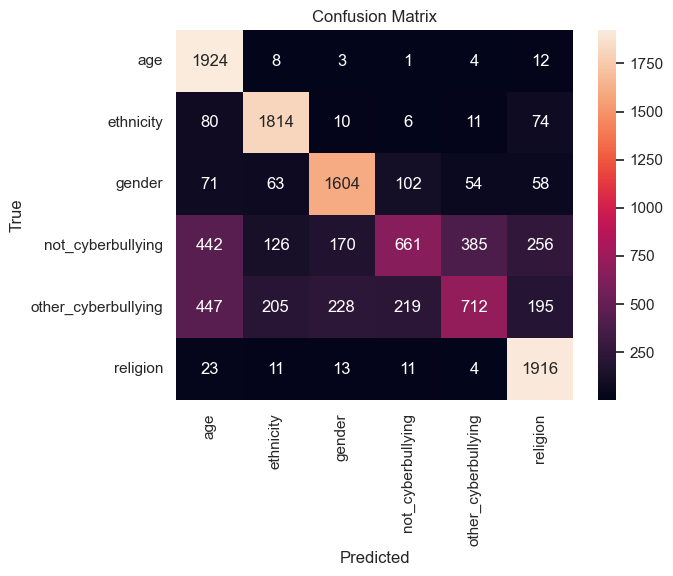
  
<em><b>Figure 10.1.1a. Confusion matrix for the Naive Bayes model.</b></em>

  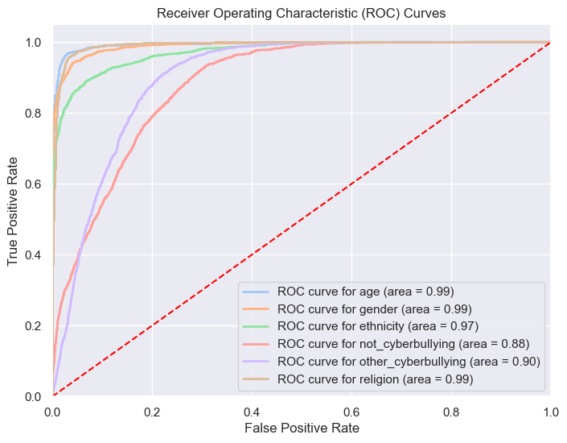
  
<em><b>Figure 10.1.1b. ROC curve for the Naive Bayes model.</b></em>

  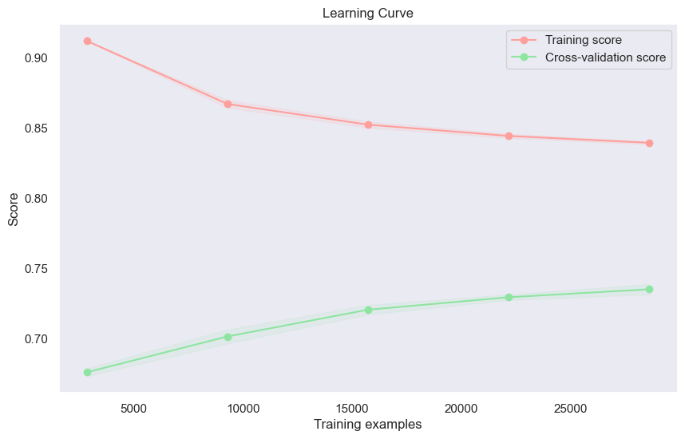
  
<em><b>Figure 10.1.1c. Learning curve for the Naive Bayes model.</b></em>

---

### 10.1.2 Logistic Regression (LR)

  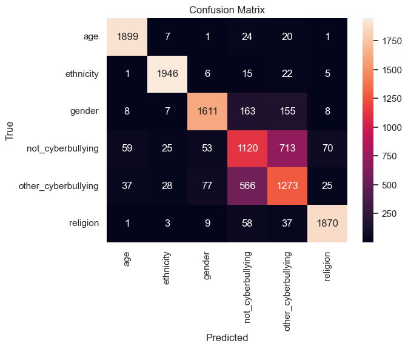
  
<em><b>Figure 10.1.2a. Confusion matrix for the Logistic Regression model.</b></em>

  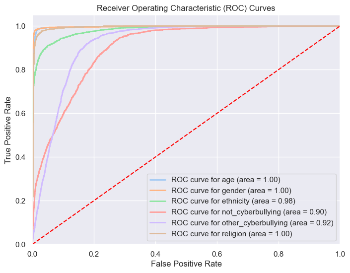
  
<em><b>Figure 10.1.2b. ROC curve for the Logistic Regression model.</b></em>

  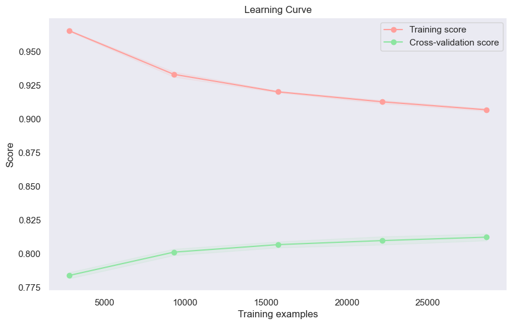
  
<em><b>Figure 10.1.2c. Learning curve for the Logistic Regression model.</b></em>

---

### 10.1.3 Support Vector Machine (SVM)

  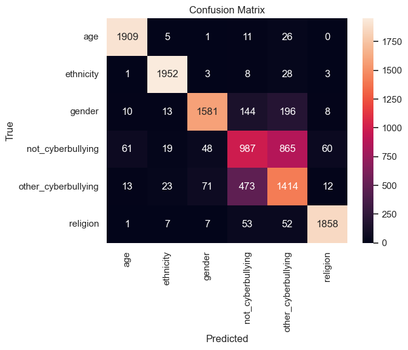
  
<em><b>Figure 10.1.3a. Confusion matrix for the SVM model.</b></em>

  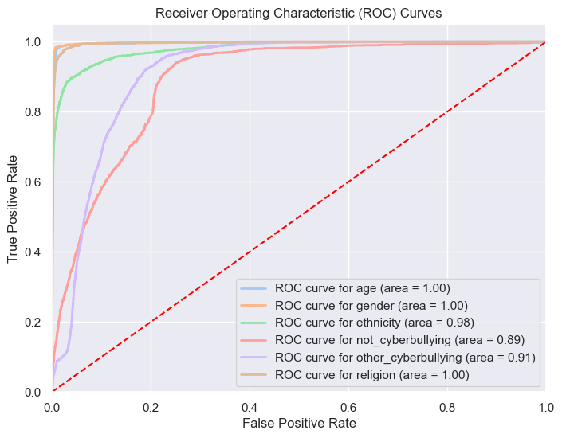
  
<em><b>Figure 10.1.3b. ROC curve for the SVM model.</b></em>

  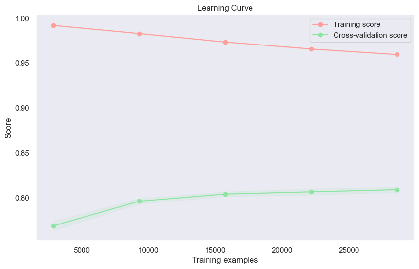
  
<em><b>Figure 10.1.3c. Learning curve for the SVM model.</b></em>

---

### 10.1.4 Random Forest (RF)

  
  
<em><b>Figure 10.1.4a. Confusion matrix for the Random Forest model.</b></em>

  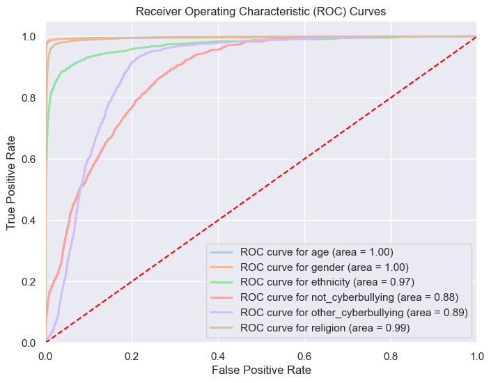
  
<em><b>Figure 10.1.4b. ROC curve for the Random Forest model.</b></em>

  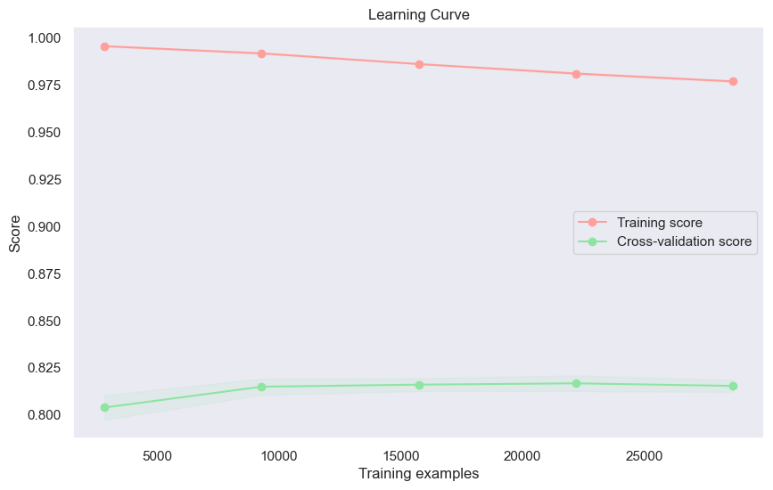
  
<em><b>Figure 10.1.4c. Learning curve for the Random Forest model.</b></em>

---