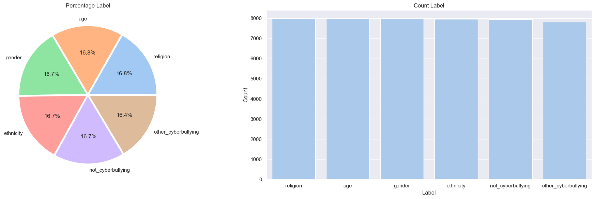
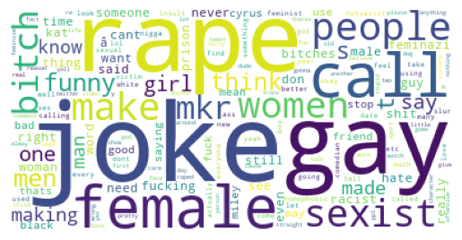
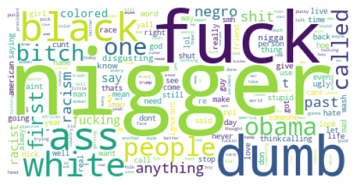
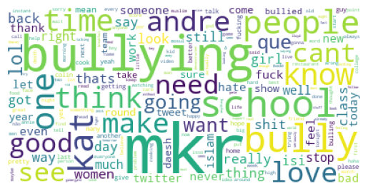

# 1. Introduction
## 1.1 Overview of Task & Research Questions

Our project is a **single-label multi-class text classification for cyberbullying detection in tweets**. For a given tweet, the goal is to assign it exactly one category in the `cyberbullying_type` column. The labels for cyberbullying can be categorized by age, gender, religion, ethnicity, other cyberbullying or not cyberbullying. 

Unlike traditional hate speech detection, which is typically framed as a binary (yes/no) classification task, our project would involve classifying each tweet into one of several closely related categories. This makes the task more challenging, as the classes often overlap in meaning. Additionally, the tweets are short, informal, and lacks context, which increases ambiguity. This therefore makes it harder for models to be able to accurately distinguish between categories.

As part of our project, our team came up with the following research questions in order to guide the direction of our project.

1. How do classical machine learning models compare against a deep learning model (Bi-LSTM) for multi-class cyberbullying detection?
2. Which cyberbullying categories are the most difficult to classify accurately?
3. What linguistic patterns and dataset characteristics contribute to model errors?

---

## 1.2 Motivation

In today's world, social media platforms have become central to modern communication, but they have also contributed to the rise of cyberbullying and online harassment. Detecting harmful content in such settings is often difficult because abusive language is often expressed through subtle linguistic cues such as sarcasm, slang and implicit aggression. Even when the task is framed as assigning one primary label per tweet, the underlying language can still be ambiguous and be difficult to interpret.

In reality, a single twitter post may contain multiple different forms of abuse at once. However, the dataset used in this project constrains the task to a **single-label classification**. This means that each tweet is assigned only one annotated category. This therefore makes the task more tractable for modeling while also introducing important limitations in how well the dataset reflects real cyberbullying behavior.

---

## 1.3 Contributions

This project contributes to this space by providing:

- A comparative evaluation of multiple classical machine learning models (**Naive Bayes, Logistic Regression, Support Vector Machine, Random Forest**) and a deep learning model (**Bi-LSTM**)
- An evaluation using the standard **multi-class classification metrics** such as precision, recall, F1-score, and accuracy
- A structured error analysis to better understand model behavior beyond its overall scores
- Insights into the linguistic and data driven challenges of cyberbullying detection

### 1.3.1 Member Contributions
| S/N | Team Members | Part |
| :-: | :- | :- |
| 1 | Zhan You Lau | Data Preparation & Cleaning, Data Visualization, Error Partitioning, Conclusion, Consolidation |
| 2 | Yu Chen Law | Data Preparation & Cleaning, Machine Learning Models, Master Error Table, Cross Model Behaviour Analysis |
| 3 | Kieran E Kai Voo | Machine Learning Models, Weights saving, Misclassification Pattern Analyiss |
| 4 | Joshua, Tse Ern Foo | Data Visualization, Machine Learning Models, Qualitative Error Analysis |

---

# 2. Brief Literature Review

Cyberbullying and abusive language detection have been widely researched in natural language processing, with extensive work spanning traditional machine learning, dataset development, and deep learning approaches.

Research by Waseem and Hovy (2016) had demonstrated that traditional machine learning models, combined with textual features such as character n-grams, can be highly effective in detecting abusive content on Twitter. Their results showed that properly engineered representations, together with simple classifiers can serve as strong and competitive baselines.

Subsequently, research expanded this field by introducing larger datasets and more fine grained annotation schemes. For example, Salawu et al. (2021) contributed a large dataset for cyberbullying and online abuse detection. This enabled more detailed categorization of harmful language. This is significant because it moves beyond simple abusive, non-abusive distinctions and supports a more nuanced modeling of different forms of online harm.

In a similar vein, deep learning approaches have also been widely explored for moderation and abuse detection tasks. For example, Pavlopoulos et al. (2017) showed that neural network architectures are actually able to capture contextual dependencies in text more effectively than traditional methods. Whereas Park and Fung (2017) had demonstrated improvements over bag-of-words approaches for abusive language detection on Twitter in certain settings.

At the same time, researchers such as Wiegand et al. (2019) also highlighted the broader challenges in abusive language detection. This includes annotation quality, dataset bias, and ambiguity in the definition the labels for abusive language. These issues are especially relevant in classification settings where confusion between classes may reflect not only model limitations, but also inherent ambiguity in the data.

While many studies frame abusive language detection as a binary classification problem, there are fewer studies that explore fine grained multi-class classification. In such classification, distinguishing between closely related categories introduces additional complexity and ambiguity on top of existing ones.

Most prior work focuses primarily on improving benchmark performance or proposing new datasets and architectures. However, there is less emphasis on understanding model behavior at a granular level. In particular, there are limited attention that has been given to how different models confuse closely related categories in multi-class cyberbullying tasks.
 
---

# 3. Methods

## 3.1 Dataset

The dataset used in this project is the [Cyberbullying Classification Dataset](https://www.kaggle.com/datasets/andrewmvd/cyberbullying-classification) from Kaggle. It consists of tweets that are labeled in the `cyberbullying_type` column. Each tweet is assigned exactly one class. The classes would include categories that different forms of cyberbullying associates with as well as a non-cyberbullying category.

---

## 3.2 Preprocessing

This is carried out so that we can standardize the tweets while retaining its linguistically meaningful content as much as possible. Since such tweets are often noisy and irregular, preprocessing is therefore neccessary in order to ensure that the data is usable for downstream models.

Therefore, in order to reduce noise and improve the quality of the text representations, the following preprocessing steps were applied:

- Conversion to lowercase  
- Removal of user mentions (`@username`)  
- Removal of URLs and picture links  
- Removal of punctuation and numbers 
- Removal of stray HTML entities  
- Removal of English stopwords  
- Removal of short words with length less than or equal to 2  
- Removal of extra whitespace 

---

## 3.3 Exploratory Analysis

Before training the models, exploratory data analysis was conducted to better understand the dataset and its label structure. This included examining the distribution of tweets across labels and visualizing vocabulary patterns using word clouds. These analyses help identify class imbalance, common language usage, and potential sources of ambiguity between labels.

  
  
<em><b>Figure 1. Class distribution of tweets across cyberbullying categories.</b></em>

The class distribution shows that the dataset is not perfectly balanced across categories, which may influence model performance and bias predictions towards more frequent classes.

To further analyze linguistic patterns, word clouds were generated for each label. A few selected word clouds for gender, religion, ethnicity, and non-cyberbullying labelled tweets are selected for illustration purposes.

  
  
<em><b>Figure 2a. Word cloud for gender category.</b></em>

  
  
<em><b>Figure 2b. Word cloud for religion category.</b></em>

  
  
<em><b>Figure 2c. Word cloud for ethnicity category.</b></em>

  
  
<em><b>Figure 2d. Word cloud for non-cyberbullying category.</b></em>

The word clouds above provides a high level view of the vocabulary used across the different labels. Certain labels, such as `religion` and `ethnicity`, exhibit more distinctive and topic specific terms that are related to identity and ideology. In contrast, categories such as `gender` and `not_cyberbullying` contains a more generic and conversational language.

Given this, it should be noted that there is a substantial overlap in frequently used words across labels, including general insults and informal expressions. This suggests that lexical features by itself may not be sufficient to clearly distinguish between the labels. Furthermore, many of the words are context dependent and they may appear in both harmful and non-harmful settings. This therefore further increases the ambiguity surrounding it.

Hence, these observations provides some insight as to why the models may struggle to separate closely related labels and are likely to produce confusion between certain labels during classification.

---

## 3.4 Feature Engineering

In this project, two main text representation strategies were used:

- **TF-IDF vectorization** for the classical machine learning models  
- **Word embeddings** for the Bi-LSTM model  

TF-IDF was chosen because it is a strong baseline for text classification. This is especially so when working with sparse textual features. This is because it is able to capture word importance relative to the corpus and often performs well on short text tasks.

For Bi-LSTM, word embeddings were used to provide dense semantic representations of the tokens. This allows the model to not just determine the word counts but learn the contextual relationships within tweet sequences.

---

## 3.5 Models

### 3.5.1 Naive Bayes

Naive Bayes was chosen as the simplest baseline model as it is simple to implement and is computationally efficient.

Although the Naive Bayes independence assumption is unrealistic, it is still well suited for high-dimensional sparse data such as TF-IDF representations. In such settings, word occurrences provide strong signals for classification, making it particularly effective as a benchmark model for comparing more complex models.

Naive Bayes is also suitable for this dataset as it contains short and sparse tweets where individual words often carry meaningful information despite limited context. However, as it assumes independence between features, it may struggle with ambiguous or labels that overlap each other.

Nevertheless, Naive Bayes serves as a useful reference point for evaluating more advanced models. In particular, it allows us to assess whether these advanced models can better capture dependencies between words and improve classification performance, especially for closely related categories.

---

### 3.5.2 Logistic Regression

Logistic Regression was chosen as it is also fairly simple and robust on high-dimensional sparse text representations.

It is well suited for text classification tasks as it learns weighted contributions of features. This allows it to identify which words are the most indicative of each label. This makes it particularly effective when classification decisions depend on the presence of key terms.

However, as a linear model it may struggle to capture complex relationships between words, especially when meaning depends on context or word combinations.

Nevertheless, Logistic Regression serves as a useful comparison to Naive Bayes. This is done by evaluating whether learning feature weights can improve classification performance, particularly for closely related categories.

---

### 3.5.3 Support Vector Machine (SVM)

SVM was selected due to its strong performance in high-dimensional feature spaces which are typical in text classification tasks.

It is well suited for text classification as it seeks to find an optimal decision boundary that maximizes the margin between classes. This makes it effective when classes are separable in feature space. This leads to strong generalization performance.

SVM is also suitable for this dataset as clear decision boundaries may exist based on key features. However, similar to linear regression models, it may struggle to capture contextual relationships between words, especially in cases involving ambiguous or overlapping labels.

Nevertheless, SVM still provides a strong benchmark for evaluating whether margin based classification can improve performance over simpler models such as Naive Bayes and Logistic Regression.

---

### 3.5.4 Random Forest

Random Forest was included as an ensemble based model that is capable of capturing non-linear patterns in the data. This is done through the combination of multiple decision trees.

It is suitable for problems where interactions between features are important. This is because it can model relationships that are not captured by linear models. This provides a useful contrast to the previous models, which rely primarily on linear decision boundaries.

Random Forest is also suitable for this dataset as it is possible for it to capture patterns based on combinations of words rather than individual words. However, tree based methods are generally less effective on high-dimensional sparse text data, as they may struggle to fully utilize the TF-IDF representations and scale less efficiently.

Nevertheless, Random Forest serves as a useful comparison to evaluate whether modeling non-linear feature interactions can improve classification performance for complex or ambiguous categories.

---

### 3.5.5 Bidirectional Long Short-Term Memory (Bi-LSTM)

The Bidirectional Long Short-Term Memory (Bi-LSTM) model was chosen as the primary deep learning architecture due to its ability to capture sequential dependencies in text.

Unlike classical models that rely on bag-of-words representations, the Bi-LSTM processes text in both forward and backward directions. This allows it to incorporate word order and surrounding context into its predictions.

This is particularly relevant for this dataset as the short and ambiguous tweets meaning would depend on how words are used together rather than on isolated keywords. By modeling sequential context, the Bi-LSTM may be able to better distinguish between closely related categories.

However, Bi-LSTM requires way more data and computational resources. It may also be sensitive to noise in informal text.

Nevertheless, the Bi-LSTM allows us to evaluate whether incorporating contextual and sequential information can improve classification performance over classical approaches.

---

# 4. Results and Evaluation

## 4.1 Evaluation Metrics

The models were evaluated using the following metrics:

- Accuracy
- Precision
- Recall
- F1-score

These are standard multi-class classification metrics and were chosen because each captures a different aspect of performance.

- **Accuracy** provides an overall measure of how often the classifier predicts the correct class  
- **Precision** measures how reliable a class prediction is when the model assigns that class  
- **Recall** measures how well the model identifies all instances of a class  
- **F1-score** balances precision and recall and is particularly useful when some classes are harder to detect or are less evenly distributed  

As cyberbullying categories may differ in frequency and difficulty, merely using accuracy alone would be insufficient. Considering precision, recall, and F1-score would therefore provide a more complete picture of model performance across categories.

---

## 4.2 Evaluation Methods

To complement the numerical evaluation metrics, several evaluation methods were used and each serves a different purpose.

- **Classification reports** to examine per-class performance  
- **Confusion matrices** to identify which classes are commonly mistaken for one another  
- **ROC curves** to analyze discrimination ability across classes and thresholds  
- **Learning curves** to assess model behavior with respect to training and validation performance  

Classification reports help compare performance across classes. Confusion matrices reveal concrete error patterns whereas ROC curves show how well classes can be separated. Lastly, learning curves can help diagnose underfitting or overfitting.

---